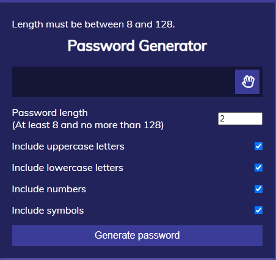
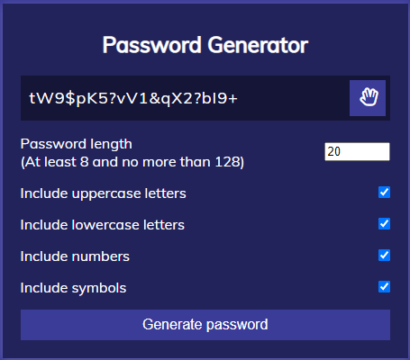
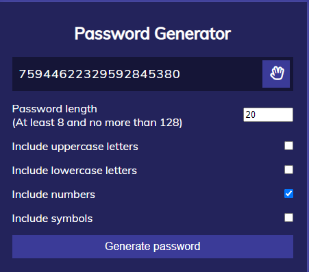
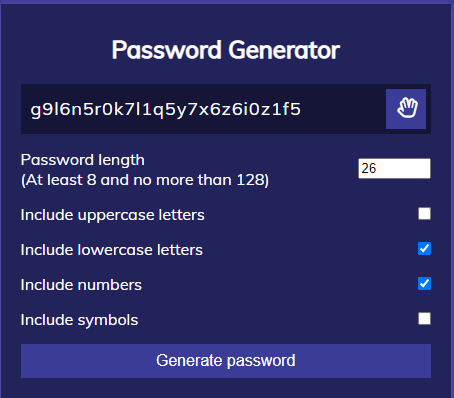
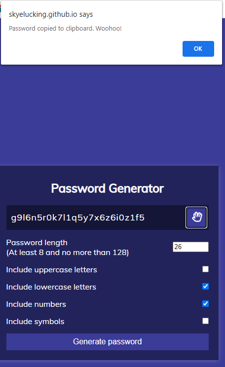

# Skye Lucking - 03 JavaScript Password Generator (Using YouTube Example)

<h1>Description of application</h1>
This application was based on the instruction of this YouTube video.
<a href="https://youtu.be/duNmhKgtcsI" target=_blank>https://youtu.be/duNmhKgtcsI</a>

 I watched it at .75 speed and followed along coding it out. 
This application generates a password that:
- Asks the user how long they'd like the password length to be
- Validates that the length so that it is bewteen 8 and 128 characters
- Offers check-boxes for the user asking if they want 1. lower case 2. upper case 3. numbers 4. special characters
- Validates that they select at least 1 character type
- Populates the password placeholder with a password 
- Allows them to click an icon to copy the password

<h1>Screenshot</h1>
 
 
 
 
 
 

<h1>Link to the deployed application</h1>
<a href="https://skyelucking.github.io/03-JavaScript-password-generator/">https://skyelucking.github.io/03-JavaScript-password-generator/</a>

<h1>Link to GitHub Repo</h1>
<a href="https://github.com/skyelucking/03-JavaScript-password-generator">https://github.com/skyelucking/03-JavaScript-password-generator</a>

Now here is your joke... 
Apparently you can’t use “ beefstew” as a password.

 
 
 
<em>It’s not stroganoff.</em>